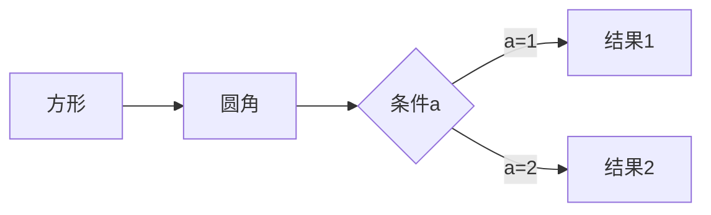

- 测试9

  > First Readme


- 标题

# title

# 一级标题

## 二级标题

### 三级标题

#### 四级标题

##### 五级标题

###### 。。。依次类推#的个数指代标题的级别 越多标题级别越大

- 段落

  段落为正常便携，后面加两个空格换行即可，空一行即可为段落    


段落。


段落2。


- 字体

*斜体* 为两个**或者两个__包围

_倾斜文本_ 为两个_ _

**粗体** 粗体为****四个 或者____包围

***粗斜体***为三个***或者___三个


- 分割线

可以在一行中用三个以上的星号，减号，底线来建立一个分割线，行内不能有其他东西，可以在星号或者减号中间插入空格，但是没必要，如：

***

---

___

- 删除线

给文字加删除线，文字两端加上~~即可. 

~~我是删除线~~

- 下划线

下划线可以通过h5的<u></u>来实现

<u>我是下划线</u>

- 脚注

这是一个脚注，使用如下[^typora]. 

[^typora]:日日日升日日落

- 列表

列表前面用-来表示（无序列表） 数字+.来表示有序列表

1. 有序列表
2. 有序列表2

- 列表嵌套Tab
  - 按下tab下个层级，按Enter取消排序
    - 下级
      - 。。。。。

取消了排序

- 区块

使用>来开头

> 这是一个块
>
> 块也可以嵌套
>
> > 在>中再用>表示嵌套快
> >
> > > 嵌套了两层了
> > >
> > > > 第三层

> 块中也可以使用列表等嵌套使用


- 代码

`print()`函数 用"``"包围为函数或者片段

- 代码区块

里面使用tab或者4个空格 如：

​	代码块

或者使用```包围一段代码，可以在头部制定语言如.  Java

```java
System.out.println("这是一段java代码块")
```

```html
<h1>这是一段h5代码块</h1>  指定语言的好处是可以自动识别和补齐相关代码段落
```

- 链接

  [链接名称]( 链接地址)或者<链接地址>

  eg：这是一个链接[链接名称](https://www.baidu.com)

  <https://www.baidu.com>

  - 高级链接（锚点）

  可以通过在文档末尾设置变量锚点，变量赋值url，[名称][锚点⚓️变量]来设置

  [锚⚓️点变量链接][锚变量]

  [锚变量]: https://baidu.com

- 图片


同理可以对图片使用变量

：这个链接使用东西冲作为变量[2021-04-03东西冲][东西冲]

[东西冲]: /Users/xiaoqiang/Pictures/b10115b0afef2b9a150e0b207426e1.jpg

markdown无法对图片指定尺寸，但是可以使用h5标签替代

</img>

- md表格

md使用|来分隔单元格，用-来分隔行，typora打出表头后会自动给出表格，可视化的操作调整

| 表头 | 表头 |      |      |
| :--: | :--: | ---- | ---- |
|  行  |  行  |      |      |
|      |      |      |      |
|      |      |      |      |

- md高级技巧和其他

  - 支持html元素

  不在md关键字覆盖范围之内的标签，都可以直接 用h5的标签来写

  使用<kbd>command</kbd>+<kbd>shift</kbd>+<kbd>G</kbd> 访问文件夹

  - 转义符

  使用\来转移需要显示的标签，如：

  \*\*正常显示星号\*\*

  - 公式

  当你需要在编辑器中插入数学公式时，可以使用两个美元符 $$ 包裹 TeX 或 LaTeX 格式的数学公式来实现。提交后，问答和文章页会根据需要加载 Mathjax 对数学公式进行渲染。如：

  > ```mathematica
  > $$
  > \mathbf{V}_1 \times \mathbf{V}_2 =  \begin{vmatrix} 
  > \mathbf{i} & \mathbf{j} & \mathbf{k} \\
  > \frac{\partial X}{\partial u} &  \frac{\partial Y}{\partial u} & 0 \\
  > \frac{\partial X}{\partial v} &  \frac{\partial Y}{\partial v} & 0 \\
  > \end{vmatrix}
  > ${$tep1}{\style{visibility:hidden}{(x+1)(x+1)}}
  > $$
  > ```

$$
\mathbf{V}_1 \times \mathbf{V}_2 =  \begin{vmatrix} 
\mathbf{i} & \mathbf{j} & \mathbf{k} \\
\frac{\partial X}{\partial u} &  \frac{\partial Y}{\partial u} & 0 \\
\frac{\partial X}{\partial v} &  \frac{\partial Y}{\partial v} & 0 \\
\end{vmatrix}
${$tep1}{\style{visibility:hidden}{(x+1)(x+1)}}
$$

___

暂时没用到

- 画流程图，时序图，甘特图等

也是代码格式，指定语言为mermaid然后填充画图代码即可，如下：




